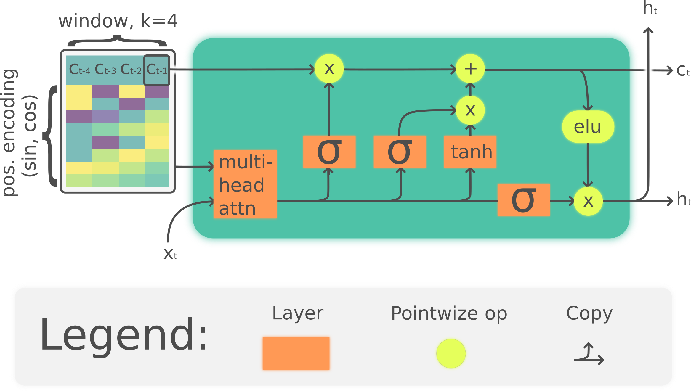

# [LARNN: Linear Attention Recurrent Neural Network](https://github.com/guillaume-chevalier/Linear-Attention-Recurrent-Neural-Network)

A fixed-size, go-back-`k` recurrent attention module on an RNN so as to have linear short-term memory by the means of attention. The LARNN model can be easily used inside a loop on the cell state just like any other RNN. The cell state keeps the `k` last states for its multi-head attention mechanism.

The LARNN is derived from the Long Short-Term Memory (LSTM) cell. The LARNN introduces attention on the state's past values up to a certain range, limited by a time window `k` to keep the forward processing linear in time in terms sequence length (time steps).

Therefore, multi-head attention with positional encoding is used on the most recent past values of the inner state cell so as to enable a better mid-term memory, such that at each new time steps, the cell looks back at it's own previous cell state values with an attention query.

## The LARNN Cell

Note that the positional encoding is concatenated rather than added. Also, the ELU activation is used in the cell. There is also batch normalization at many places (not drawn). The Multi-Head Attention Mechanism uses an ELU activation rather than unactivated Linears, for the keys and values and the query. There is here only one query rather than many queries.

<p align="center">
  
</p>

Yes, it LARNNs.

## Downloading the dataset

```
cd data
python3 download_dataset.py
cd ..
```

## Meta-optimize the LARNN

This will launch a round of meta-optimisation which will save the results under a new `./results/` folder.

```
python3 hyperopt_optimize.py --dataset UCIHAR --device cuda
```

Two training rounds have been executed and renamed under the folders `./results_round_1/` and `./results_round_2/` for now.

## Visualize the results

You can visually inspect the effect of every hyperparameter on the accuracy, and their correlated effect, by navigating at:

- [Results for round 1](https://github.com/guillaume-chevalier/Linear-Attention-Recurrent-Neural-Network/blob/master/AnalyzeTestHyperoptResults_round_1.ipynb)
- [Results for round 2](https://github.com/guillaume-chevalier/Linear-Attention-Recurrent-Neural-Network/blob/master/AnalyzeTestHyperoptResults_round_2.ipynb)

You could also copy and run one of those files on new results by simply changing the results folder in the `jupyter-notebook` such that your new folder is taken.

## The hyperparameters space searched with meta-optimization

Here are the hyperparameters and their respective value ranges, which have been explored:

```
HYPERPARAMETERS_SPACE = {
    ### Optimization parameters
    # This loguniform scale will multiply the learning rate, so as to make
    # it vary exponentially, in a multiplicative fashion rather than in
    # a linear fashion, to handle his exponentialy varying nature:
    'learning_rate': 0.005 * hp.loguniform('learning_rate_mult', -0.5, 0.5),
    # How many epochs before the learning_rate is multiplied by 0.75
    'decay_each_N_epoch': hp.quniform('decay_each_N_epoch', 3 - 0.499, 10 + 0.499, 1),
    # L2 weight decay:
    'l2_weight_reg': 0.005 * hp.loguniform('l2_weight_reg_mult', -1.3, 1.3),
    # Number of loops on the whole train dataset
    'training_epochs': 25,
    # Number of examples fed per training step
    'batch_size': 256,

    ### LSTM/RNN parameters
    # The dropout on the hidden unit on top of each LARNN cells
    'dropout_drop_proba': hp.uniform('dropout_drop_proba', 0.05, 0.5),
    # Let's multiply the "default" number of hidden units:
    'hidden_size': 64 * hp.loguniform('hidden_size_mult', -0.6, 0.6),
    # The number 'h' of attention heads: from 1 to 20 attention heads.
    'attention_heads': hp.quniform('attention_heads', 6 - 0.499, 36 + 0.499, 1),

    ### LARNN (Linear Attention RNN) parameters
    # How restricted is the attention back in time steps (across sequence)
    'larnn_window_size': hp.uniform('larnn_window_size', 10, 50),
    # How the new attention is placed in the LSTM
    'larnn_mode': hp.choice('larnn_mode', [
        'residual',  # Attention will be added to Wx and Wh as `Wx*x + Wh*h + Wa*a + b`.
        'layer'  # Attention will be post-processed like `Wa*(concat(x, h, a)) + bs`
        # Note:
        #     `a(K, Q, V) = MultiHeadSoftmax(Q*K'/sqrt(dk))*V` like in Attention Is All You Need (AIAYN).
        #     `Q = Wxh*concat(x, h) + bxh`
        #     `V = K = Wk*(a "larnn_window_size" number of most recent cells)`
    ]),
    # Wheter or not to use Positional Encoding similar to the one used in https://arxiv.org/abs/1706.03762
    'use_positional_encoding': hp.choice('use_positional_encoding', [False, True]),
    # Wheter or not to use BN(ELU(.)) in the Linear() layers of the keys and values in the multi-head attention.
    'activation_on_keys_and_values': hp.choice('activation_on_keys_and_values', [False, True]),

    # Number of layers, either stacked or residualy stacked:
    'num_layers': hp.choice('num_layers', [2, 3]),
    # Use residual connections for the 2nd (stacked) layer?
    'is_stacked_residual': hp.choice('is_stacked_residual', [False, True])
}
```

The [best results](/results_round_2/UCIHAR/model_0.9192399049881235_b4105.txt.json) were found with those hyperparameters, for a test accuracy of 91.924%:

```
{
    "activation_on_keys_and_values": true,
    "attention_heads": 27,
    "batch_size": 256,
    "decay_each_N_epoch": 26,
    "dropout_drop_proba": 0.08885391813337816,
    "hidden_size": 81,
    "is_stacked_residual": true,
    "l2_weight_reg": 0.0006495900377590891,
    "larnn_mode": "residual",
    "larnn_window_size": 38,
    "learning_rate": 0.006026504115228934,
    "num_layers": 3,
    "training_epochs": 100,
    "use_positional_encoding": false
}
```

## Retrain on best hyperparameters found by meta-optimization

You can re-train on the best hyperparameters found with this command:

```
python3 train.py --dataset UCIHAR --device cuda
```

Note: before being able to run this command, you will need to have `.json` files from training results under the path `./results/UCIHAR/`. Currently, the best results are found within `./results_round_2/UCIHAR/`, the folder could be renamed to make this command work.

## Debug the LARNN model

This command is practical if you want to edit the model and potentially print-debug its dimensions:

```
python3 larnn.py
```

## Some thoughts and self-assessment

Although the LARNN cell obtains better results than the LSTM cell as [explored here](https://github.com/guillaume-chevalier/LSTM-Human-Activity-Recognition), the LARNN is more complicated and hence the LSTM cell is still very interesting and probably of greater value.

However, the LARNN would still have to be compared to a deeply stacked setup such as [done here](https://github.com/guillaume-chevalier/HAR-stacked-residual-bidir-LSTMs), where better results are obtained, but by using many more cells which means the current project could still perform better with more cells and proper regularization.

It seems that the positional encoding tried here is not helpful for the learning.

So overall, despite the LARNN not bringing huge improvements in accuracy, the most interesting thing about this project are: 
- The code which is reusable and neat for being easily adaptable to automatically hyperoptimize on other datasets and networks. 
- The discovery that adding an activation on the multi-head self-attention mechanism's keys, queries and values performed well in the context here, better than using no activation. 
- To my best knowledge, a new neural attention data structure is created by using a queue for an attention mechanism, sliding through time, and this data structure could potentially be very interesting in many other applications where attention is required. 
- The figures are reusable, published under CC-BY in the subfolder, while the code is published under the MIT License and also reusable. 

The current dataset is solveable with good accuracy without any attention mechanism. So the current project was more to code something interesting to than genuinely try to improve the accuracy on a small dataset. I coded this in 1 week so I couldn't use a very complicated dataset and rebuild a complete data pipeline - I had to reuse old code of mine that I already knew.

## References

The current project contains code derived from those other projects:

- https://github.com/guillaume-chevalier/LSTM-Human-Activity-Recognition
- https://github.com/guillaume-chevalier/HAR-stacked-residual-bidir-LSTMs
- https://github.com/guillaume-chevalier/Hyperopt-Keras-CNN-CIFAR-100
- https://github.com/Vooban/Hyperopt-Keras-CNN-CIFAR-100
- https://github.com/harvardnlp/annotated-transformer

More information on which pieces of code comes from where in the headers of each Python files. All of those references are licensed under permissive open-source licenses, such as the MIT License and the Apache 2.0 License.

## Paper (Citing)

For more information, see the paper's page on [arXiv](https://arxiv.org/abs/1808.05578).

## License

My [project](https://github.com/guillaume-chevalier/Linear-Attention-Recurrent-Neural-Network) is freely available under the terms of the [MIT License](https://github.com/guillaume-chevalier/Linear-Attention-Recurrent-Neural-Network/blob/master/LICENSE).

Copyright (c) 2018 Guillaume Chevalier

*Note: my [drawings](https://github.com/guillaume-chevalier/Linear-Attention-Recurrent-Neural-Network/tree/master/inkscape_drawings) are specially available under the [CC-BY](http://creativecommons.org/licenses/by/4.0/) license rather than under the MIT License.*

## Connect with me

- https://ca.linkedin.com/in/chevalierg
- https://twitter.com/guillaume_che
- https://github.com/guillaume-chevalier/
